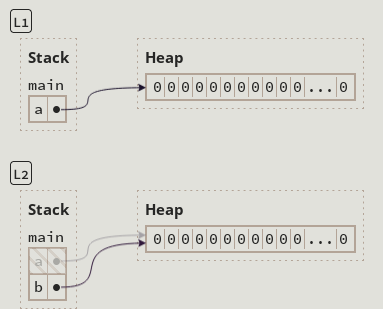
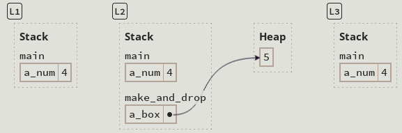

Ownership es una característica única en Rust y tiene implicaciones profundas para el resto del lenguaje. Permite a Rust garanticia la seguridad en memoria sin necesitar un recolector de basura, es importante entender como funciona ownership.

Ownership es la disciplina para asegurar la seguridad en programas de Rust, ¿pero qué jace un programa seguro en Rust?

#### La seguridad es la abstencia de comportamiento indefinido

Ejemplo de programa seguro:
```
fn read(y: bool) {
if y {
		println!("y is true!");
	}
}

fn main() {
	let x: bool = true;
	read(x);
}
```

Podemos hacer este programa inseguro de ejecutar moviendo la función read antes que la definición de x.

```
fn read(y: bool) {
if y {
		println!("y is true!");
	}
}

fn main() {
	read(x); // oh no! x isn't defined
	let x: bool = true;
}
```

Este último ejemplo es inseguro porque ejecutamos la función read(x) sin que x esté declarado.

El objetivo de Rust es compilar programas en binarios muy eficientes que requieran algunos chequeos en runtime si es posible. Pero Rust no chequea si una variable es definida antes de usarla en runtime, si no que lo hace en tiempo de compilación. Si tratamos de compilar el último ejemplo nos saldrá lo siguiente:

```
error[E0425]: cannot find value `x` in this scope
 --> src/main.rs:8:10
  |
8 |     read(x); // oh no! x isn't defined!
  |          ^ not found in this scope
```

Probablemente tienes la intuición de que es bueno que Rust asegure que las variables estén definidas antes de ser usadas. Para justificar esto, debemos preguntarnos:
**¿Qué pasaría si Rust permitiera compilar un programa que normalmente sería rechazado?**

Lo primero que debemos considerar, es como el programa seguro se compila y ejecuta. En un ordenador con una arquitectura [x86](https://es.wikipedia.org/wiki/X86), Rust generará el siguiente código en lenguaje ensamblador para la función main:
```
main:
    ; ...
    mov     edi, 1
    call    read
    ; ...
```

Este código en ensamblador hará:
- Mover el número 1, representando true, en un registro (una especie de variable en ensamblador) llamada edi.
- Llamará a la función read, que espera recibir el argumento y desde el registro edi.
Si la función 'unsafe' permitiera ser compilada, el ensamblador se vería así:
```
main:
    ; ...
    call    read
    mov     edi, 1    ;mov is after call
    ; ...
```
El programa es un inseguro porque 'read' espera que el registro edi sea un bool, pero edi puede ser cualquier cosa (2, 100, 0x1337BEEF)...
Entonces cuando read quiere usar el argumento y, inmediatamente causará un error de comportamiento indefinido.

Rust no especifica que pasa si intentas correr if y {...} cuando y no es true o false. Ese comportamiento, o lo que ocurre al ejecutar la instrucción, es indefinido. Algo pasará, por ejemplo:

- El código se ejecuta sin crashear, y no nos enteramos del problema.
- El código crashea y nos devuelve un error de sistema operativo.
- El código ejecuta sin crashear, pero un actor malicioso crea el input correcto para tirar tu sistema.

**El fundamento principal de Rust, es asegurarse que tu programa nunca tenga un comportamiento indefinido.** Ese es el significado de safety. El comportamiento indefinido es especialmente peligroso especialmente para programas de bajo nivel que acceden a la memoria. **El 70% de las vulnerabilidades** son causadas por corrupción en la memoria.

El segundo objetivo de Rust es prevenir el comportamiento indefinido en timepo de compilación en lugar de hacerlo en run-time. Este objetivo tiene dos motivaciones:
1. Atrapar bugs en tiempo de compilación significa evitar bugs en producción, mejorando la legibilidad del software.
2. Atrapar bus en tiempo de compilación significa tener menos chequeos en runtime para esos bugs, mejorando el rendimiento.
#### Ownership como desciplina para la seguridad de memoria

Desde que safety es la abstencia de comportamiento indefinido y desde que ownership es seguridad, entonces necesitamos entender ownership en términos de prevención de comportamiento indefinido. Por el momento, vamos a centrarnos en una categoría: 

**Operaciones en memoria**

La memoria es el espacio donde se almacenan los datos en la ejecución de un programa. Hay muchas maneras de pensar en memoria:

- Si no estamos familiarizados con la programación de sistemas, podemos pensar en la memoria en alto nivel, "la memoria es la RAM de un ordenador" o "La memoria es eso que se desborda si tiene demasiada información"
- Sin embargo, si estamos familiarizados, podemos pensar en la memoria en bajo nivel, "la memoria es un array de bytes" o "la memoria son punteros que nos devuelve malloc".

Ambos modelos de memoria son correctos, pero no son demasiado útiles si pensamos como funciona Rust. El modelo de alto nivel es demasiado abstracto para entender cómo funciona Rust. Necesitamos entender el concepto de puntero por ejemplo. El modelo de bajo nivel es demasiado concreto para explicar el funcionamiento. Rust no permite interpretar la memoria como un array de bytes por ejemplo.

Rust tiene una forma particular de entender la memoria. Ownership es la disciplina de usar la memoria de manera segura dentro de esa forma de pensar. Es decir, un conjunto de reglas que permiten usar la memoria de forma segura según la forma en que Rust piensa y gestiona datos.

#### Variables live in the Stack

El stack (o pila) es la zona de la memoria que un programa usa para guardar datos temporales como:

- Variables locales
- Parámetros de funciones
- Direcciones de retorno

Funciona literalmente como una pila de datos, El último que se pone es el primero que se quita. (LIFO) last in first out.

¿Cómo funciona?

```
fn saluda() {
	let mensaje = "Hola";
}
fn main() {
	saluda();
}
```

1 - Cuando saluda() se llama, se empujan al stack:
- El espacio para mensaje
- La dirección de retorno
2 - Cuando termina saluda(), esos datos se sacan del stack

-> Es muy rápido, porque no necesita buscar espacio libre (se mueve un puntero hacia arriba o abajo)
-> Tiene un tamaño limitado y por eso no se usa para todo.
-> En Rust es clave para el sistema de ownership, porque lo que está en el stack se **libera automáticamente** cuando la función termina.

Un ejemplo en un programa real, donde definimos un número #n y llamamos una funciçon #plus_one. 

```
fn main() {
	let n = 5; #L1
	let y = plus_one(n); #L3
	println!("The value of y is: {y}");
}
fn plus_one(x: i32) -> i32 {
	#L2 x + 1
}
```

Fases del stack en cada momento:

| L1                             | L2                                                  | L3                                  |
| ------------------------------ | --------------------------------------------------- | ----------------------------------- |
| main<br>n = 5<br><br>--------- | main<br>n = 5<br><br>---------<br>plus_one<br>x = 5 | main<br>n = 5<br>y = 6<br>--------- |
Las variables vien en frames. Un frame es una asignación de variables a valores dentro de un ámbito, como una función. Es decir, Rust crea una "caja" temporal donde guarda todo lo que necesita en esa función, esa caja en un frame.

Cada frame, está organizado en un stack de funciones. Por ejemplo, en el nivel #L2 , el marco de #main se encuentra encima del marco de la función #plus_one. Después de que la función retornam Rust deasigna el marco de esta función, es decir, lo saca. Al ser un stack, la función que entra última (#plus_one) es la primera en salir.

---------------------------------

> [!NOTE] ESTE MODELO DE MEMORIA NO DESCRIBE CON PRECISIÓN COMO FUNCIONA RUST!
> Como hemos visto antes con el código ensamblador, el compilador de Rust pone #n o #x en un registro en lugar de un frame. Pero esta distinción no es mñas que un detalle de implementación. No deberia cambiar nuestro entendimiento de safety en Rust.


Cuando usamos una variable en Rust, no se accede directamente al valor, sino que Rust hace una copia del valor desde donde está guardado.
Ese lugar es su slot en el stack frame. Cuando una expresión lee una variable, ocurre lo mismo. Coge una copia del valor desde su slot en el stack. Ejemplo:

```
let a = 5; #L1
let mut b = a; #L2 
b += 1; #L3
```

| L1            | L2                     | L3                     |
| ------------- | ---------------------- | ---------------------- |
| main<br>a = 5 | main<br>a = 5<br>b = 5 | main<br>a = 5<br>b = 6 |
El valor de es copiado dentro de b, el a no es cambiado aunque b si que cambie. Es decir, son **copias independientes**.

### Boxes Live In The Heap

Copiar datos puede ocupar mucha memoria. Por ejemplo, aqui hay un programa ligeramente diferente. El programa copia un array de 1 millón de elementos:

```
let a = [0; 1_000_000]; #L1
let b = a;
```

| L1                                | L2                                |
| --------------------------------- | --------------------------------- |
| a = [0 0 0 0 0 0 0 0 0 0 0 ... 0] | a = [0 0 0 0 0 0 0 0 0 0 0 ... 0] |
|                                   | b = [0 0 0 0 0 0 0 0 0 0 0 ... 0] |
Observamos que para copiar a -> b, causa que el main frame contenga 2 millones de elementos.

Para transferir datos sin copiarlos, Rust usa punteros. Un puntero es una variable que describe una localización en memoria. El valor al que apunta un puntero se llama su referente (pointee). Una forma común de crear un puntero es asignando memoria en el heap. **El heap es la región de memoria separada donde los datos pueen vivir indefinidamente.** Los datos en el heap no están ligados a un frame de stack específico. 
Rust proporciona una construcción llamada #box para colocar datos en el heap. Por eje mplo, podemos envolver el array de un millón de elementos en Box::new así:

let a = Box::new(0; 1_000_000); #L1
let b = a; #L2 



Ahora, de manera interna, solo hay un array. En L1, el valor de a es un puntero al array que está dentro del heap. 
b = a, copia el puntero de a -> b, pero la data apuntada no es copiada. Notamos que en #L2 esta tachada, esto es porque ha sido movida (veremos esto que significa un poco más adelante).

Box::new crea un puntero inteligente que guarda los datos en el **heap** en lugar del stack.
Cuando hacemos:
`let b = Box::new(value);`
Rust:
- Reserva memoria en el heap para el valor
- Copia el valor al heap
- Devuelve un box que:
	- vive en el stack
	- contiene un puntero al valor real en el heap

#### Rust no permite la gestión manual de memoria

La gestión de memoria es el proceso de asignar y desasignar memoria. Es decir, es el proceso de encontrar memoria no utilizada y luego devolver esa memoria cuando ya no se necesita. Los **frame stack** son gestionados automáticamente por Rust. Cuando se llama a una función, Rust asigna un frame stack para la función llamada, cuando esta termina, Rust desasigna ese frame stack.


#### Box's Owner gestiona la desasignación

> [!NOTE] Box Deallocation Principle
> Si una variable está en un Box, cuando Rust desasigne el frame de la variable, entonces Rust desasignará el box de la heap.

Veamos este ejemplo:

```
fn main() {
	let a_num = 4; #L1 
	make_and_drop(); #L3
}
fn make_and_drop() {
	let a_box = Box::new(5);
}
```



En #L1, antes de llamar a la función make_and_drop, el estado de la memoria es solo el stack frame para main. Luego en #L2 cuando llamamos a make_and_drop, a_box apunta a 5 que se encuentra en el heap.
Una vez make_and_drop finaliza, Rust desasigna el stack frame y luego libera el heap. En #L3 el heap está vacío.

La heap memory de la caja se ha gestionado correctamente. Pero, ¿qué pasa si abusamos de este sistema? ¿Qué pasa si apuntamos dos variables a una misma caja?

```
let a = Box::new([0;1_000_000]);
let b = a;
```

Aquí finalmente llegamos al concepto de ownership. Cuando a se vincula a Box::new([0; 1_000_000]) decimos que a posee el box. La instrucción let b = a, transfiere la propiedad de box de a -> b. Esto es el principio de deasignación.

'Si una variable posee un box, cuando Rust libre el frame stack de la variable, entonces libera la memoria del heap del box'

### Collections Use Boxes

Box es usado por estructuras de datos como #Vec, #String y #Hashmap para mantener un número de elementos. Por ejemplo, aquñi tenemos un programa que crea, mueve y muta a String:

```
fn main() {
	let first = String::from("Ferris"); #L1
	let full = add_suffix(first); #L4
	println!("{full}");
}
fn add_suffix(mut name: String) -> String {
	#L2 name.push_str("Jr"); #L3
	name
}
```

L1 -> let first = String::from("Ferris");
- Crea una cadena de tipo String con el texto "Ferris"
- Esta cadena se almacena en el heap y la variable first en el estack apunta a esa cadena.
- En Rust un String tinee 3 componentes en el Stack:
	- Un puntero al heap donde está contenido
	- La logintud de la cadena
	- Capacidad total reservada

L2 -> let full = add_suffix(name = first);
- Aquí se llama a la función add_suffix, pasando first como argumento
- Rust no copia la cadena, si no que mueve la propiedad de first a name.
- Eso significa que first ya no es válido después de esta linea
- Solo se copia el puntero internamente, no el contenido del heap

L3 -> name.push_str(" Jr.");
- Ahora en la función, la variable name es la dueña de la cadena "Ferris"
- Al usar push_str("Jr.") Rust debe:
	1. Aumentar la capacidad del buffer en el heap para el nuevo texto
	2. Escribir "Jr." al final
	3. Liberar la memoria original
	- Esti es muy eficiente, ero también significa que el puntero original que tenía first ya no apunta a nada válida.

L4 -> return name;
- Se retorna name, transfiriendo su propiedad al llamador
- En main, esa propiedad pasa a la variable full
- Cuando termina add_suffix, se elimina el stack frame de esa función, pero no se borra el contenido del heap porque el ownership fue transferido.

#### Cloning Avoids Moves

Una manera de evitar mover datos es clonarlos utilizando el método .clone() 
```
fn main() {
	let first = String::from("Ferris");
	let first_clone = first.clone();
	let full = add_suffix(first_clone);
	println!("{full}, originally {first}");
}

fn add_suffix(mut name: String) -> String {
	name.push_str(" Jr.");
	name
}
```

En primer lugar tenemos first y first_clone en el stack que apuntan a sus respectivos valores en el heap. Cuando ejecutamos add_suffix, first_clone es mocido e invalidado, pero la variable first está intacta. Por lo que sería seguro seguir utilizándola.
